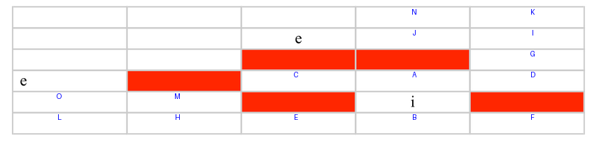
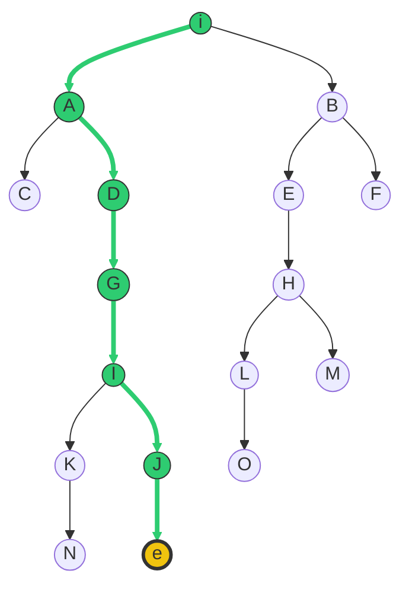

# Ejercicio 1: Búsquedas

## Búsqueda en Anchura (Breadth-First Search)
### Descripción del Problema
Este ejercicio consiste en encontrar el camino más corto en un entorno de rejilla (grid) desde una posición inicial **i** hasta un objetivo **e**. El agente (NPC) puede moverse en cuatro direcciones (horizontal y vertical) con un coste unitario por movimiento, evitando las zonas bloqueadas (obstáculos).


#### Detalles del Entorno:
- **Estado Inicial:** (i).
- **Estado Objetivo:** (e).
- **Algoritmo Aplicado:** Búsqueda en Anchura (BFS).
- **Orden de Expansión:** Arriba, Abajo, Izquierda, Derecha.

---

### Metodología y Traza de Ejecución
Se ha utilizado una **cola (FIFO)** para gestionar la frontera, lo que garantiza que el camino encontrado sea el óptimo en cuanto a número de pasos. A continuación, se detalla la evolución de los conjuntos de nodos durante la búsqueda:

| Paso | Nodo Expandido (Padre) | Exploradas (Nodo(Padre)) | Fronteras / Cola (Nodo(Padre)) |
| :--- | :--- | :--- | :--- |
| 0 | - | - | $i (-)$ |
| 1 | **$i (-)$** | $i (-)$ | $A(i), B(i)$ |
| 2 | **$A (i)$** | $i, A(i)$ | $B(i), C(A), D(A)$ |
| 3 | **$B (i)$** | $i, A, B(i)$ | $C(A), D(A), E(B), F(B)$ |
| 4 | **$C (A)$** | $i, A, B, C(A)$ | $D(A), E(B), F(B)$ |
| 5 | **$D (A)$** | $i, A, B, C, D(A)$ | $E(B), F(B), G(D)$ |
| 6 | **$E (B)$** | $i, A, B, C, D, E(B)$ | $F(B), G(D), H(E)$ |
| 7 | **$F (B)$** | $i, A, B, C, D, E, F(B)$ | $G(D), H(E)$ |
| 8 | **$G (D)$** | $i, \dots, G(D)$ | $H(E), I(G)$ |
| 9 | **$H (E)$** | $i, \dots, H(E)$ | $I(G), L(H), M(H)$ |
| 10 | **$I (G)$** | $i, \dots, I(G)$ | $L(H), M(H), K(I), J(I)$ |
| 11 | **$L (H)$** | $i, \dots, L(H)$ | $M(H), K(I), J(I), O(L)$ |
| 12 | **$M (H)$** | $i, \dots, M(H)$ | $K(I), J(I), O(L)$ |
| 13 | **$K (I)$** | $i, \dots, K(I)$ | $J(I), O(L), N(K)$ |
| 14 | **$J (I)$** | $i, \dots, J(I)$ | $O(L), N(K), \mathbf{e(J)}$ |



---

### Árbol de Búsqueda Visual
El siguiente diagrama representa la jerarquía de exploración. La línea resaltada en verde indica el camino solución reconstruido a través de los nodos padres.



## Búsqueda en Profundidad (Depth-First Search)

### Descripción del Problema
En este caso, resolvemos el mismo entorno de rejilla pero aplicando el algoritmo de **Búsqueda en Profundidad (DFS)**. El objetivo es observar cómo la estrategia de exploración cambia radicalmente, priorizando la profundidad sobre la proximidad al nodo inicial.


#### Detalles Técnicos:
- **Estado Inicial:** (i).
- **Estado Objetivo:** (e).
- **Estructura de Datos:** Pila (Stack - LIFO).
- **Orden de Prioridad:** Arriba, Abajo, Izquierda, Derecha.

---

### Metodología y Traza de Ejecución (DFS)
En DFS, el último nodo en entrar en la frontera es el primero en ser expandido. Esto genera una exploración en forma de "hilo" o camino único hasta encontrar un callejón sin salida.

| Paso | Nodo Expandido (Padre) | Exploradas (Nodo(Padre)) | Fronteras / Pila (Nodo(Padre)) |
| :--- | :--- | :--- | :--- |
| 0 | - | - | $i (-)$ |
| 1 | **$i (-)$** | $i (-)$ | $[B(i), A(i)]$ |
| 2 | **$A (i)$** | $i, A(i)$ | $[B(i), D(A), C(A)]$ |
| 3 | **$C (A)$** | $i, A, C(A)$ | $[B(i), D(A)]$ (C es callejón sin salida) |
| 4 | **$D (A)$** | $i, A, C, D(A)$ | $[B(i), G(D)]$ |
| 5 | **$G (D)$** | $i, A, C, D, G(D)$ | $[B(i), I(G)]$ |
| 6 | **$I (G)$** | $i, A, C, D, G, I(G)$ | $[B(i), J(I), K(I)]$ |
| 7 | **$K (I)$** | $i, \dots, I, K(I)$ | $[B(i), J(I), N(K)]$ |
| 8 | **$N (K)$** | $i, \dots, K, N(K)$ | $[B(i), J(I), Q(N)]$ |
| 9 | **$Q (N)$** | $i, \dots, N, Q(N)$ | $[B(i), J(I)]$ (Q es callejón sin salida) |
| 10 | **$J (I)$** | $i, \dots, Q, J(I)$ | $[B(i), \mathbf{e(J)}]$ |

---

### Árbol de Exploración DFS
A diferencia del árbol de BFS, aquí se observa cómo el algoritmo "bucea" por la rama de **K** y **N** antes de retroceder (backtracking) para encontrar el nodo **e** a través de **J**.

```mermaid
graph TD
    i((i)) --> B((B))
    i((i)) --> A((A))
    A --> D((D))
    A --> C((C))
    D --> G((G))
    G --> I((I))
    I --> J((J))
    I --> K((K))
    K --> N((N))
    N --> Q((Q))
    J --> e((e))

    %% Estilo de la exploración profunda
    linkStyle 1,2,4,5,7,8 stroke:#e74c3c,stroke-width:2px,stroke-dasharray: 5 5
    linkStyle 1,2,4,5,6,10 stroke:#2ecc71,stroke-width:4px
    
    style i fill:#2ecc71
    style A fill:#2ecc71
    style D fill:#2ecc71
    style G fill:#2ecc71
    style I fill:#2ecc71
    style J fill:#2ecc71
    style e fill:#f1c40f,stroke:#333
    style K fill:#ff9999
    style N fill:#ff9999
    style Q fill:#ff9999