# Ejercicios módulo Modelos de Inteligencia Artificial.
 🧠 *Especialidad Inteligencia Artificial y Big Data.* 📊 

## Resolución de problemas mediante búsquedas.

## Ejercicio 1:
### Algoritmos a aplicar:
1. Búsqueda en anchura.
2. Búsqueda en profundidad.
3. Algoritmos A y A*.
### Descripción del Problema

Este ejercicio consiste en encontrar el camino más corto en un entorno de rejilla (grid) desde una posición inicial **i** hasta un objetivo **e**. El agente (NPC) puede moverse en cuatro direcciones (horizontal y vertical) con un coste unitario por movimiento, evitando las zonas bloqueadas (obstáculos).

#### Detalles del Entorno:
- **Estado Inicial:** (i).
- **Estado Objetivo:** (e).
- **Orden de Expansión:** Arriba, Abajo, Izquierda, Derecha.
- **Coste de movimiento**:
  * Vertical: 1.
  * Horizontal: 2.
  
### Búsqueda en Anchura (Breadth-First Search)
#### Metodología y Traza de Ejecución
Se ha utilizado una **cola (FIFO)** para gestionar la frontera, lo que garantiza que el camino encontrado sea el óptimo en cuanto a número de pasos. A continuación, se detalla la evolución de los conjuntos de nodos durante la búsqueda:

| Paso | Nodo Expandido (Padre) | Exploradas (Nodo(Padre)) | Fronteras / Cola (Nodo(Padre)) |
| :--- | :--- | :--- | :--- |
| 0 | - | - | $i (-)$ |
| 1 | **$i (-)$** | $i (-)$ | $A(i), B(i)$ |
| 2 | **$A (i)$** | $i, A(i)$ | $B(i), C(A), D(A)$ |
| 3 | **$B (i)$** | $i, A, B(i)$ | $C(A), D(A), E(B), F(B)$ |
| 4 | **$C (A)$** | $i, A, B, C(A)$ | $D(A), E(B), F(B)$ |
| 5 | **$D (A)$** | $i, A, B, C, D(A)$ | $E(B), F(B), G(D)$ |
| 6 | **$E (B)$** | $i, A, B, C, D, E(B)$ | $F(B), G(D), H(E)$ |
| 7 | **$F (B)$** | $i, A, B, C, D, E, F(B)$ | $G(D), H(E)$ |
| 8 | **$G (D)$** | $i, \dots, G(D)$ | $H(E), I(G)$ |
| 9 | **$H (E)$** | $i, \dots, H(E)$ | $I(G), L(H), M(H)$ |
| 10 | **$I (G)$** | $i, \dots, I(G)$ | $L(H), M(H), K(I), J(I)$ |
| 11 | **$L (H)$** | $i, \dots, L(H)$ | $M(H), K(I), J(I), O(L)$ |
| 12 | **$M (H)$** | $i, \dots, M(H)$ | $K(I), J(I), O(L)$ |
| 13 | **$K (I)$** | $i, \dots, K(I)$ | $J(I), O(L), N(K)$ |
| 14 | **$J (I)$** | $i, \dots, J(I)$ | $O(L), N(K), \mathbf{e(J)}$ |

---

---

#### Árbol de Búsqueda Visual
El siguiente diagrama representa la jerarquía de exploración. La línea resaltada en verde indica el camino solución reconstruido a través de los nodos padres.

### Búsqueda en Profundidad (Depth-First Search)

#### Descripción del Problema
En este caso, resolvemos el mismo entorno de rejilla pero aplicando el algoritmo de **Búsqueda en Profundidad (DFS)**. El objetivo es observar cómo la estrategia de exploración cambia radicalmente, priorizando la profundidad sobre la proximidad al nodo inicial.

##### Detalles Técnicos:
- **Estado Inicial:** (i).
- **Estado Objetivo:** (e).
- **Estructura de Datos:** Pila (Stack - LIFO).
- **Orden de Prioridad:** Arriba, Abajo, Izquierda, Derecha.

---

#### Metodología y Traza de Ejecución (DFS)
En DFS, el último nodo en entrar en la frontera es el primero en ser expandido. Esto genera una exploración en forma de "hilo" o camino único hasta encontrar un callejón sin salida.

| Paso | Nodo Expandido (Padre) | Exploradas (Nodo(Padre)) | Fronteras / Pila (Nodo(Padre)) |
| :--- | :--- | :--- | :--- |
| 0 | - | - | $i (-)$ |
| 1 | **$i (-)$** | $i (-)$ | $[B(i), A(i)]$ |
| 2 | **$A (i)$** | $i, A(i)$ | $[B(i), D(A), C(A)]$ |
| 3 | **$C (A)$** | $i, A, C(A)$ | $[B(i), D(A)]$ (C es callejón sin salida) |
| 4 | **$D (A)$** | $i, A, C, D(A)$ | $[B(i), G(D)]$ |
| 5 | **$G (D)$** | $i, A, C, D, G(D)$ | $[B(i), I(G)]$ |
| 6 | **$I (G)$** | $i, A, C, D, G, I(G)$ | $[B(i), J(I), K(I)]$ |
| 7 | **$K (I)$** | $i, \dots, I, K(I)$ | $[B(i), J(I), N(K)]$ |
| 8 | **$N (K)$** | $i, \dots, K, N(K)$ | $[B(i), J(I), Q(N)]$ |
| 9 | **$Q (N)$** | $i, \dots, N, Q(N)$ | $[B(i), J(I)]$ (Q es callejón sin salida) |
| 10 | **$J (I)$** | $i, \dots, Q, J(I)$ | $[B(i), \mathbf{e(J)}]$ |

---

#### Árbol de Exploración DFS
A diferencia del árbol de BFS, aquí se observa cómo el algoritmo "bucea" por la rama de **K** y **N** antes de retroceder (backtracking) para encontrar el nodo **e** a través de **J**.

### Búsqueda A* (Depth-First Search)
Ejercicio resuelto a mano para práctica de posible examen de este algoritmo en el módulo MIA (Modelos de Inteligencia Artificial)
#### Declarión

#### Resolución

## Ejercicio 2:
### Búsqueda por coste uniforme
#### Descripción del Problema
En el hipotético caso de que el servicio Google Maps empleara el algoritmo de búsqueda por coste uniforme para encontrar la ruta más corta (en km) entre dos localidades, calcula la solución que ofrecería para la ruta Ourense-Calatayud dadas las siguientes distancias kilométricas:

| Trayecto            | Distancia en km      |
| :------------------ | :------------------:|
| Ourense, Ponferrada | 175                 |
| Ourense, Benavente  | 236                 |
| Ponferrada, León    | 113                 |
| Ponferrada, Benavente | 125               |
| Benavente, León     | 75                  |
| Benavente, Valladolid | 112               |
| Benavente, Palencia | 112                 |
| Palencia, León      | 131                 |
| Palencia, Valladolid | 48                 |
| Palencia, Osorno    | 49                  |
| Palencia, Burgos    | 92                  |
| León, Osorno        | 121                 |
| Osorno, Burgos      | 59                  |
| Valladolid, Aranda  | 95                  |
| Burgos, Aranda      | 84                  |
| Aranda, Osma        | 58                  |
| Osma, Calatayud     | 140                 |
| Osma, Soria         | 58                  |
| Burgos, Soria       | 143                 |
| Burgos, Logroño     | 150                 |
| Logroño, Soria      | 106                 |
| Soria, Calatayud    | 91                  |

#### Grafo Detallado de Búsqueda por Coste Uniforme (BCU)
Este grafo muestra la expansión del algoritmo con los pesos de cada arista (distancia en km) y el coste acumulado en cada nodo.

```mermaid
graph TD
    O(Ourense: 0) -- 175 --> P(Ponferrada: 175)
    O -- 236 --> B(Benavente: 236)

    P -- 113 --> L1(León: 288)
    P -- 125 --> B_alt(Benavente: 300 - Descartado)

    B -- 75 --> L2(León: 311 - Descartado)
    B -- 112 --> V(Valladolid: 348)
    B -- 112 --> PAL(Palencia: 348)

    PAL -- 49 --> OS(Osorno: 397)
    V -- 95 --> A(Aranda: 443)

    PAL -- 92 --> BUR(Burgos: 440)
    A -- 58 --> OSM(Osma: 501)

    OSM -- 58 --> S(Soria: 559)
    OSM -- 140 --> C(Calatayud: 641)

    S -- 91 --> C2(Calatayud: 650 - Descartado)

    style C fill:#f96,stroke:#333,stroke-width:4px
    style O fill:#bbf,stroke:#333,stroke-width:2px
```

#### Resultado de la Ruta Óptima
La solución encontrada ofrece una distancia total de 641 km, siguiendo este trayecto:
1. **Ourense** $\rightarrow$ **Benavente** (236 km)
2. **Benavente** $\rightarrow$ **Valladolid** (112 km)
3. **Valladolid** $\rightarrow$ **Aranda** (95 km)
4. **Aranda** $\rightarrow$ **Osma** (58 km)
5. **Osma** $\rightarrow$ **Calatayud** (140 km)
   * **Coste Total: 641**
